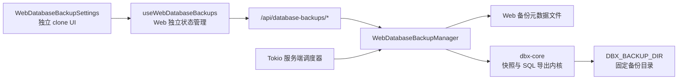

# Web 数据库备份实施方案

## 文档状态

- 日期：2026-07-22
- 状态：已批准、已实施并通过验收
- 目标版本：Web 单实例部署
- 核心决策：Web 独立实现备份 UI、状态管理、调度和文件生命周期；仅复用 `dbx-core` 已有数据库快照与 SQL 导出内核。

## 1. 目标

在 DBX Web 端实现与桌面端产品能力相近的数据库定时备份，包括：

- 创建、编辑、启停和删除备份计划。
- 手动立即执行备份。
- 按小时、每天、每周定时执行。
- 选择连接、数据库和表过滤规则。
- 配置结构、数据、数据库对象等备份内容。
- 记录运行状态、执行历史和错误信息。
- 按保留数量清理旧备份。
- 将备份文件写入 Web 服务器上的固定目录。
- 浏览器关闭后，备份计划仍由服务端可靠执行。

本方案以最小改动和上游升级可维护性为优先，不重构桌面端已有备份功能。

## 2. 硬约束

### 2.1 桌面端零行为影响

- 不修改桌面端 `ScheduledDatabaseBackupSettings.vue`。
- 不修改桌面端 `useScheduledDatabaseBackups.ts`。
- 不改变桌面端 localStorage 数据格式、目录选择、调度和历史记录行为。
- 不将 Web 特有字段加入桌面端备份类型。
- 不为了 Web 复用而重构桌面端备份模块。
- 桌面端已有测试应保持原样通过。

### 2.2 Web UI 采用 clone 模式

- 以当前桌面备份页面为视觉和交互参考，复制形成 Web 独立组件。
- Web 组件、composable、类型和 API 客户端使用独立文件和 `WebDatabaseBackup` 命名。
- Web 后续可以独立调整交互，不要求与官方桌面 UI 持续同步。
- 允许继续复用项目通用 UI 原子组件，如 `Button`、`Dialog`、`Input`、`Select`，但不复用桌面备份业务组件。

### 2.3 路径由服务端控制

- 浏览器不能提交任意服务器文件路径。
- 备份根目录由服务端配置决定。
- 所有生成、删除和查询文件操作都必须约束在备份根目录内。
- API 默认只返回文件名或相对路径，不把客户端传入的路径作为文件系统操作依据。

### 2.4 第一版只支持单 Web 实例

- 同一份 `DBX_DATA_DIR` 只允许一个 `dbx-web` 进程负责调度。
- 第一版不实现分布式锁、Leader 选举和多副本任务抢占。
- 如果未来支持多副本，再将调度锁升级为数据库锁或外部分布式锁。

## 3. 现状与边界

桌面版备份目前由前端完成全部编排：

```text
设置 UI
  -> useScheduledDatabaseBackups
  -> localStorage 保存计划和历史
  -> 浏览器定时器判断到期计划
  -> Tauri API 创建一致性快照
  -> dbx-core 导出 SQL 到用户选择目录
  -> 前端删除过期文件并更新历史
```

这条链路不能直接用于 Web，原因包括：

- 浏览器关闭后前端定时器停止。
- localStorage 只属于当前浏览器，不能作为服务端任务的权威存储。
- Web 浏览器不能选择或操作服务器目录。
- 多个浏览器打开时可能重复执行同一计划。
- 现有 Web 一次性导出接口使用临时文件，下载后删除，不符合长期备份文件的生命周期。

Web 备份应改为：

```text
Web 独立设置 UI
  -> Web 备份 API
  -> WebDatabaseBackupManager
  -> 服务端计划和历史存储
  -> 服务端定时器
  -> dbx-core 一致性快照与 SQL 导出
  -> 固定服务器备份目录
```

## 4. 总体架构



架构原则：

1. Web API 与定时器都调用同一个 `WebDatabaseBackupManager`，避免手动执行和定时执行产生两套逻辑。
2. Manager 负责业务编排，不复制数据库导出实现。
3. `dbx-core` 只作为稳定执行内核使用，不加入 Web UI、计划存储或 Web 调度概念。
4. 桌面端继续使用原来的前端调度链路，与 Web 链路并行存在。

## 5. 能力复用与定制开发

### 5.1 直接复用

| 能力 | 现有实现 | Web 使用方式 |
| --- | --- | --- |
| 连接配置和连接池 | `dbx-core::connection::AppState` | 服务端根据 `connectionId` 读取并连接 |
| 数据库列表 | `schema::list_databases_core` | 执行计划时动态解析全部或指定数据库 |
| 表列表 | `schema::list_tables_core` | 执行 include/exclude 过滤前读取实时表清单 |
| 一致性快照 | `begin_database_backup_snapshot_core` | 每个数据库备份开始时创建快照 |
| SQL 导出 | `export_database_sql_core` | 将输出路径设置为服务端生成的固定路径 |
| 快照内流式读取 | `snapshot_session_id` | 保持 MySQL/PostgreSQL 一致性读取 |
| 导出取消标记 | `set_export_cancelled` | Web 运行取消时传递到当前子导出任务 |
| 手动事务回滚 | `rollback_manual_transaction` | 每个数据库导出结束或失败时释放快照 |
| Docker 持久卷 | `/app/data` | 默认备份目录位于 `/app/data/backups` |
| 通用 UI 原子组件 | `components/ui/*` | Web clone 页面继续使用统一视觉基础 |

### 5.2 参考后复制，不建立代码依赖

以下能力参考桌面实现语义，但在 Web 模块中独立实现：

| 能力 | 复制原因 |
| --- | --- |
| 备份计划 DTO | 避免 Web 字段和生命周期影响桌面类型 |
| 频率与下次执行时间计算 | 服务端必须独立计算，不能依赖浏览器运行 |
| 数据库目标解析规则 | 服务端执行时需要独立校验连接和数据库变化 |
| 表 include/exclude 模式 | 服务端需要在真实执行边界重新解析和校验 |
| 文件命名规则 | 服务端生成文件名，客户端不能控制路径 |
| 保留数量清理 | 文件和运行记录都归服务端管理 |
| 设置页面 | 使用 clone，降低官方升级时冲突和联动风险 |
| 运行状态管理 | Web 以服务端状态为准，不读取桌面 localStorage |

复制后的代码不要求与桌面实现形成共享抽象。必要时通过测试保证关键语义一致，而不是通过共用文件保证一致。

### 5.3 Web 定制开发

- 固定备份目录配置和安全路径解析。
- Web 备份计划与运行历史持久化。
- 服务端定时调度器。
- Web 备份任务执行编排。
- 运行互斥、取消和重启恢复。
- Web 备份 CRUD 与运行 API。
- Web 独立设置页面和 composable。
- Web 部署配置与运维说明。

## 6. 模块与文件边界

建议新增以下 Web 独立文件。最终命名可以在实现阶段小幅调整，但模块边界不变。

### 6.1 前端

```text
apps/desktop/src/components/web-backup/
  WebDatabaseBackupSettings.vue

apps/desktop/src/composables/
  useWebDatabaseBackups.ts

apps/desktop/src/lib/web-backup/
  webDatabaseBackup.ts
  webDatabaseBackupApi.ts
```

职责：

- `WebDatabaseBackupSettings.vue`：从桌面页面 clone 后独立维护。
- `useWebDatabaseBackups.ts`：加载服务端计划和历史，处理 CRUD、立即运行、取消和轮询。
- `webDatabaseBackup.ts`：Web 独立 DTO、格式化和前端表单校验。
- `webDatabaseBackupApi.ts`：只封装 Web 备份 HTTP API，不加入 Tauri backend 接口。

不把 Web API 加入 `lib/backend/api.ts` 的统一 Tauri/HTTP backend 契约，避免为了类型对齐给桌面 Tauri 增加无意义的空实现。

### 6.2 Web 后端

```text
crates/dbx-web/src/database_backup/
  mod.rs
  model.rs
  store.rs
  manager.rs
  scheduler.rs

crates/dbx-web/src/routes/
  database_backup.rs
```

职责：

- `model.rs`：计划、运行记录、文件记录和状态类型。
- `store.rs`：元数据加载、原子保存和启动恢复。
- `manager.rs`：执行计划、状态更新、取消、保留清理和互斥。
- `scheduler.rs`：定时扫描到期计划并提交 Manager。
- `routes/database_backup.rs`：HTTP 参数校验和响应转换，不承载执行逻辑。

### 6.3 必要的上游接入点

共享或官方文件的修改压缩在以下位置：

| 文件 | 修改范围 |
| --- | --- |
| `EditorSettingsDialog.vue` | Web 环境显示“数据库备份”入口，并挂载 Web clone 组件；桌面分支仍挂载原组件 |
| `crates/dbx-web/src/routes/mod.rs` | 注册 Web 备份 route 模块 |
| `crates/dbx-web/src/main.rs` | 初始化备份目录、Manager、Scheduler 和 API 路由 |
| `crates/dbx-web/src/state.rs` | 持有 Web 备份 Manager 引用 |
| Docker/部署文档 | 增加固定目录与持久化说明 |

其中设置页采用薄适配：

```text
运行时是 Web     -> WebDatabaseBackupSettings
运行时是 Desktop -> ScheduledDatabaseBackupSettings（现状不变）
```

不复制整个 `EditorSettingsDialog.vue`，因为该文件体量大，整体 clone 会制造更高的长期升级成本。

## 7. 服务端存储方案

### 7.1 第一版选择

第一版使用 Web 专属 JSON 元数据文件：

```text
DBX_DATA_DIR/web-database-backups.json
```

文件保存：

- 备份计划。
- 最多 200 条运行历史。
- 最近执行时间、状态和下一次执行时间。
- 每次运行生成的相对文件路径。

选择独立 JSON 而不是修改 `dbx-core::Storage` 的原因：

- 不修改桌面端共用 SQLite schema。
- 不给桌面端引入 Web 专属持久化方法。
- 上游升级冲突面更小。
- 计划和历史数据量小，整文件读写足够。

写入要求：

- Manager 内部使用互斥锁串行修改状态。
- 先写同目录临时文件，再原子 rename 覆盖正式文件。
- 写入失败时保留上一份有效文件。
- 启动时遇到损坏文件应报错并停止调度，不能静默覆盖用户计划。

后续当历史查询、审计或多实例成为需求时，再迁移到专用 SQLite 表。

## 8. 固定备份目录

目录解析规则：

```text
DBX_BACKUP_DIR 已配置
  -> 使用 DBX_BACKUP_DIR

DBX_BACKUP_DIR 未配置
  -> 使用 DBX_DATA_DIR/backups
```

启动阶段应完成：

1. 创建目录。
2. 解析为绝对、规范化路径。
3. 验证目录可写。
4. 将规范化根目录保存在 Manager 中。

文件操作规则：

- API 不接受 `destinationDirectory`。
- 服务端根据计划名称、时间、数据库/Schema 和运行 ID 生成文件名。
- 元数据保存相对于备份根目录的路径。
- 删除文件前重新拼接、规范化并确认路径仍位于备份根目录内。
- 只删除 DBX 管理的 `.sql` 文件。
- 不提供服务器文件管理器“显示文件”功能。

Docker 默认已经持久化 `/app/data`，因此默认目录不需要新增 volume。若运维需要宿主机固定路径，可以将宿主机目录挂载到 `/app/data/backups`，或同时设置 `DBX_BACKUP_DIR`。

## 9. 服务端执行模型

### 9.1 单次计划执行

执行过程：

1. 获取计划级运行锁，拒绝同一计划重复运行。
2. 创建 `running` 运行记录并持久化。
3. 从 `AppState` 读取最新连接配置。
4. 检查数据库类型，第一版只允许 MySQL 和 PostgreSQL。
5. 获取当前数据库列表，解析全部或指定数据库。
6. 对每个数据库创建一致性快照。
7. 获取 Schema 和表列表，应用 include/exclude 规则。
8. 为每个数据库/Schema 构造 `DatabaseExportRequest`。
9. 由服务端生成目标文件路径并调用 `export_database_sql_core`。
10. 无论成功、失败或取消，都回滚快照事务并释放会话。
11. 更新运行记录和计划的最近执行状态。
12. 成功后执行保留数量清理。
13. 计算并保存下一次执行时间。

### 9.2 并发策略

第一版采用保守策略：

- 全局同时只运行一个 Web 数据库备份。
- 多个到期计划按计划名称或下次执行时间顺序串行执行。
- 同一计划不能并发手动执行和定时执行。
- Manager 持有活动运行和当前子导出 ID，用于取消。

串行策略可以降低数据库和服务器磁盘压力，也能减少第一版的状态竞争。未来有明确性能需求后再增加可配置并发数。

### 9.3 取消

- 取消 API 根据 run ID 找到当前子导出 ID。
- 调用现有 `set_export_cancelled(exportId)`。
- 当前导出退出后停止后续数据库/Schema。
- 删除本次运行已生成的部分文件。
- 运行状态记录为 `cancelled`。

### 9.4 服务重启恢复

启动加载元数据时：

- 历史中遗留的 `running` 记录改为 `failed`。
- 错误原因记录为服务重启导致任务中断。
- 尝试删除该运行记录中已知的部分文件。
- 已到期计划进入正常调度扫描，不直接并发补跑多次。

## 10. 调度模型

- `dbx-web` 启动后创建一个 Tokio 后台任务。
- 默认每 30 秒扫描一次到期计划。
- 调度器只负责发现到期计划，实际执行全部委托给 Manager。
- 计划保存或启用后立即重新计算 `nextRunAt`。
- 每次运行结束后推进到下一次执行时间。
- 第一版以服务端时区解释每天/每周时间，部署文档必须明确配置容器时区。

需要避免“逐次补跑”问题：如果服务离线数天，启动后只补执行一次当前已到期计划，然后从完成时间计算下一次运行，不循环执行所有错过的时间点。

## 11. Web API 轮廓

建议使用独立命名空间：

```text
GET    /api/database-backups/config
GET    /api/database-backups/schedules
POST   /api/database-backups/schedules
PUT    /api/database-backups/schedules/{scheduleId}
DELETE /api/database-backups/schedules/{scheduleId}

GET    /api/database-backups/runs
POST   /api/database-backups/schedules/{scheduleId}/run
POST   /api/database-backups/runs/{runId}/cancel
DELETE /api/database-backups/runs/{runId}
```

其中：

- `config` 返回功能是否可用、显示用备份目录和服务端时区。
- 保存计划时服务端重新校验所有字段，不信任前端规范化结果。
- 删除运行记录时同时删除该记录关联且位于备份根目录内的文件。
- 第一版前端通过短间隔轮询活动运行和较长间隔刷新历史，不新增复杂 WebSocket 协议。
- 所有路由继续受现有 Web 登录认证中间件保护。

第一版不提供备份文件下载接口。备份文件面向服务器运维目录保存；如果后续需要浏览器下载，应新增只接受 run ID/file ID 的受控下载接口，不能接受绝对路径。

## 12. Web clone UI 方案

Web 页面从现有桌面备份设置复制后做以下独立调整：

- 删除 Tauri 目录选择器。
- 备份目录显示为服务端返回的只读值。
- 删除“在文件管理器中显示”。
- 数据来源改为 Web API，不读取桌面备份 localStorage。
- “立即备份”只提交服务端任务，不在浏览器中编排导出。
- 活动运行状态以服务端为准。
- 保留计划、数据库、表过滤、周期、备份内容和历史列表的主要交互。
- 服务端不可用或备份目录不可写时禁用创建和执行按钮，并显示明确原因。

为了减少对官方设置页的改动，设置页只负责按运行时选择组件，不承载 Web 备份逻辑。

## 13. 实施阶段

### 阶段一：服务端基础与手动备份

- 建立 Web 独立 model、store 和 manager。
- 完成固定目录初始化和路径安全校验。
- 完成计划 CRUD、历史查询和手动执行 API。
- 使用 `dbx-core` 快照和导出内核生成持久 SQL 文件。
- 完成取消、失败清理和运行状态持久化。

验收目标：不依赖前端页面常驻，可以通过 API 创建计划并手动生成备份文件。

### 阶段二：服务端定时调度

- 增加 Tokio 调度器。
- 实现到期判断、下一次时间推进和单实例互斥。
- 实现重启恢复和错过执行策略。
- 实现保留数量清理。

验收目标：关闭浏览器后计划仍能按时执行，重启容器后计划和历史仍存在。

### 阶段三：Web clone UI

- clone 桌面备份设置页面。
- 建立 Web 独立 composable、DTO 和 API 客户端。
- 在设置页增加最薄的运行时分发。
- 完成计划管理、立即执行、取消和历史刷新。

验收目标：Web 设置中完整可用，桌面端页面和行为无变化。

### 阶段四：部署、测试与文档

- 增加 `DBX_BACKUP_DIR` 与时区说明。
- 增加 Docker volume 示例。
- 完成 Rust 单元测试、Web API 测试和前端测试。
- 完成真实 MySQL/PostgreSQL 手动验证。

## 14. 验证方案

### 14.1 自动化测试

Web 后端测试：

- 计划字段规范化和边界值。
- 小时、每天、每周的下一次执行时间。
- 全部数据库排除系统库。
- include/exclude 通配符和大小写规则。
- 固定根目录路径逃逸防护。
- JSON 元数据原子保存、损坏文件和重启恢复。
- 同一计划重复运行保护。
- 保留数量只清理旧成功记录。
- 取消和失败时清理部分文件。
- API 认证、CRUD 和状态码。

前端测试：

- Web 环境显示 clone 备份页面。
- Web 页面不导入 Tauri 目录选择器。
- Web 页面不读写桌面备份 localStorage key。
- Desktop 环境仍渲染原 `ScheduledDatabaseBackupSettings`。
- Web API 失败时页面状态正确收敛。

现有回归：

- `packages/app-tests/scheduledDatabaseBackup.test.ts` 原样通过。
- 桌面备份相关测试原样通过。
- `cargo test -p dbx-web`。
- `cargo test -p dbx-core database_export`。
- `pnpm typecheck` 和相关 Vitest。

### 14.2 人工验证

1. MySQL 和 PostgreSQL 分别创建手动、每天和每周计划。
2. 关闭所有浏览器页面，确认服务端仍执行计划。
3. 重启容器，确认计划和历史保留。
4. 验证 SQL 文件位于固定目录且内容可恢复。
5. 验证表 include/exclude 和多 Schema 文件命名。
6. 执行中取消，确认事务释放、部分文件删除、状态为取消。
7. 修改或删除数据库后执行计划，确认返回可理解错误且调度器继续工作。
8. 验证保留数量只删除受 DBX 管理的旧备份文件。
9. 打开桌面版，确认原备份页面、目录选择和调度行为完全不变。

## 15. 非目标

第一版不包含：

- 多 Web 实例分布式调度。
- 对象存储、S3、WebDAV 或云端备份。
- 备份压缩和加密。
- 浏览器下载、在线预览和在线恢复。
- 失败通知、邮件或 Webhook。
- SQL Server、Oracle、SQLite 等新增数据库类型。
- 桌面与 Web 备份计划互相迁移或同步。
- 对桌面备份代码进行公共抽象或重构。

## 16. 升级与冲突控制

上游升级时遵循以下策略：

- Web 业务文件全部使用新目录和 `WebDatabaseBackup` 前缀，避免与官方文件同路径修改。
- 不主动同步官方桌面备份页面的新功能；需要时按产品需求人工挑选到 Web clone。
- `EditorSettingsDialog.vue` 只保留运行时组件分发，冲突时重新应用少量接入代码。
- `dbx-web` 的 route/state/main 接入保持薄层，核心实现集中在新增模块。
- 不修改 `dbx-core` 导出行为；如果上游导出函数签名变化，只调整 Manager 调用点。
- 每次合并上游后优先运行桌面原备份测试和 Web 备份测试，分别确认两条链路。

## 17. 已确定与后续细化项

### 已确定

- Web 采用服务端托管备份。
- Web UI 使用 clone 模式，不共用桌面备份业务组件。
- 桌面备份行为不变。
- 路径固定在服务器，由服务端控制。
- 服务端负责计划、调度、执行、历史和保留清理。
- 数据库快照与 SQL 导出复用 `dbx-core`。
- 第一版按单 Web 实例设计。
- 第一版不提供下载和恢复。

### 实现前再细化

- Web DTO 的最终字段名和错误码。
- 元数据 JSON 的版本字段与迁移格式。
- 服务端时区的具体读取和展示方式。
- 前端活动运行轮询间隔。
- 计划排队顺序和手动运行遇到全局任务占用时的提示。
- 备份目录不可写时是禁止服务启动，还是只禁用备份功能。
